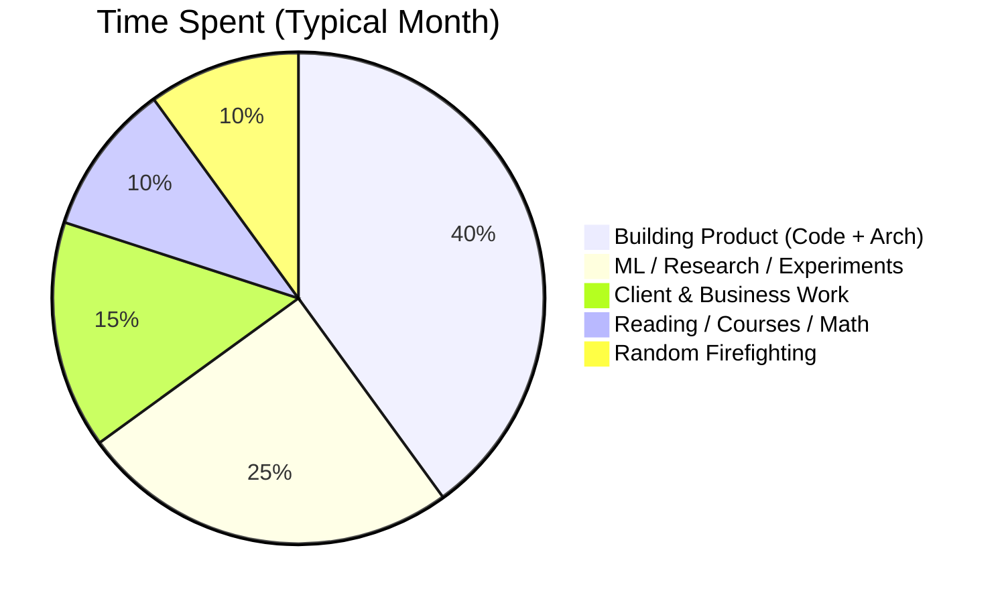

<!-- Profile README for: Shasan Dhakal -->

<h1 align="center">👋 Hey, I'm <span style="color:#16a34a;">Shasan Dhakal</span></h1>

<p align="center">
  Founder @ <b>KuberBytes</b> • Product & Tech @ <b>Cortifox Systems</b> <br/>
  ML Engineer / Researcher • Logistics & SaaS Nerd • Future (Non-Delusional) Billionaire-in-Training
</p>

---

## 🚀 What I Actually Do (Most of the Time)

> I build AI-first SaaS for <b>logistics</b>, <b>accounting</b>, and <b>education</b> – and then obsess over making them not-crap, stable, and actually used.

| Product / Engine    | One-liner Value Prop                                      | Status     |
|---------------------|-----------------------------------------------------------|------------|
| **LogiFreight CMS** | Operating system for freight forwarders & logistics      | 🚢 Shipping |
| **LedgerBooks AI**  | Accounting + ERP with ML-powered insights                | 📊 In dev  |
| **Clausegen**       | Contract / document workflow automation with AI          | ✍️ Building |
| **EnrollDesk**      | Education CRM & admissions automation                    | 🎓 Running |
| **FinQrypt**        | DeFi-style savings & remittance experiments              | 🧪 R&D      |
| **Canopus (SMIS)**  | School management information system                     | 🏫 Live     |

---

## 📈 Tiny Fake Dashboard of My Brain

### Focus Radar (Self-Reported, Brutally Honest)

```text
Reliable ML / MLOps       ███████████░ 90%
Logistics & Supply Chain  █████████░░░ 80%
Multi-tenant SaaS Design  ██████████░░ 85%
DevOps / Cloud Infra      ████████░░░░ 65%
Hardcore Theoretical Math ██████░░░░░░ 50%  ← actively fixing
Research Writing Polish   ███████░░░░░ 60%  ← getting sharper
```

---

## 🧠 What I Care About (Technically)

- **Reliable ML** – models that don’t fall apart when the data distribution sneezes  
- **Physics / constraints-aware ML** – respecting reality instead of just loss curves  
- **Logistics & operations** – shipments, manifests, ledgers, cashflows  
- **Multi-tenant SaaS** – one codebase, many tenants, clean isolation  
- **End-to-end systems** – from Postgres schema → API → frontend → deployment → metrics  

---

## 📊 Skill Snapshot (Charts Because Why Not)

### Time Allocation (Rough, But Not Lying)



### Tech Stack Heat Map

```text
Backend (Django / DRF / Laravel)     ██████████░
Frontend (React / Next / AntD)       ███████████
Databases (PostgreSQL, Redis)        █████████░░
ML (PyTorch, Python, Jupyter)        █████████░░
DevOps (Docker, CI/CD, Cloud)        ████████░░░
WordPress / Marketing Pages          ███████░░░░
```

---

## 🛠️ Tech I Use Without Googling Every Two Minutes

**Languages & Core**
- Python, JavaScript/TypeScript, PHP
- SQL (PostgreSQL), a bit of NoSQL when forced

**Backend & APIs**
- Django, Django REST Framework  
- Laravel + Sanctum / Passport  
- Multi-tenant SaaS patterns (schema & database level)

**Frontend**
- React, Next.js  
- Ant Design, Reactstrap, Bootstrap  
- State: Redux, RTK Query, Context where it actually makes sense

**ML / Data**
- PyTorch, scikit-learn  
- Jupyter, NumPy, Pandas  
- Playing with physics-informed ML & graph-based models

**Infra & DevOps**
- Docker, Docker Compose  
- Nginx, VPS hosting  
- GitHub Actions (basic CI/CD), Cloudflare, random Linux hacks

---

## 📚 Current (Honest) Learning & Upgrade Plan

### 1️⃣ Math & Theory (Because “I’ll do it later” already expired)

- Real analysis foundations  
- Linear algebra beyond “just invert the matrix”  
- Probability, stochastic processes  
- Numerical methods for ML / scientific computing  

### 2️⃣ Research Discipline

- Turning notebooks into actual **papers**, not graveyards  
- Better experiment tracking, baselines, and ablations  
- Submitting to accessible but real journals / conferences

---

## 📦 Some Things I’m (Probably) Putting on GitHub

> Not everything is open-sourced (yet), but this is the vibe.

- `logifreight-cms` – core logistics engine, micro-modules for shipment, manifest, invoices  
- `ledgerbooks-core` – chart of accounts, vouchers, POS / sales, inventory  
- `clausegen-workflows` – contract lifecycle, templates, approvals, AI helpers  
- `ml-lab-fluid-sr` – physics-aware super-resolution experiments for flows / grids  
- `kuber-utils` – shared utilities for multi-tenant SaaS, auth, billing, and tenants

---

## 📉 Honesty Corner (Things I’m Actively Fixing)

- I sometimes try to build “version 3” before shipping “version 1”.  
- I underestimate how long **writing** (docs, papers, SOPs) actually takes.  
- I have more ideas than completed repos. Working on flipping that ratio.

---

## 📊 GitHub Stats (Replace Username & Uncomment)

<!--


-->

---

## 📅 Contributions Mood (ASCII Edition)

```text
Legend: ░ = thinking, ▓ = building, █ = shipping

Week 1:  ░░▓▓▓█
Week 2:  ▓▓███▓
Week 3:  ░▓▓███
Week 4:  ░░▓███
```

If this ever becomes all `░`, something is seriously wrong.

---

## 🤝 Let’s Connect / Build

- ✉️ Email: _add your email here_  
- 🌐 Website / Portfolio: _add your link here_  
- 💼 LinkedIn: _add your link here_  

If you’re into **logistics, accounting, DeFi-ish experiments, physics-aware ML, or hardcore SaaS**, DM me.  
If you’re just here to lurk my repos… also fine. Clone responsibly. 😄
