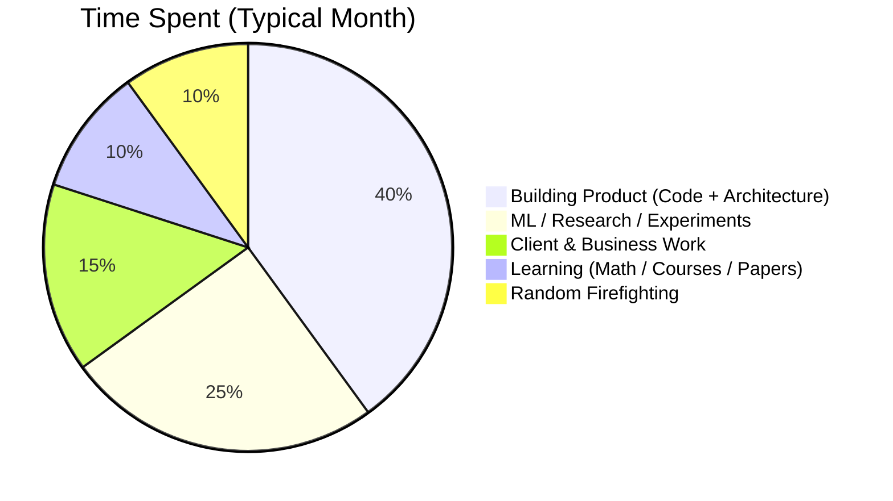

<!-- Profile README for: Shasan Dhakal -->

<h1 align="center">👋 Hey, I'm <span style="color:#16a34a;">Shasan Dhakal</span></h1>

<p align="center">
  Founder @ <b>KuberBytes</b> • Product & Tech @ <b>Cortifox Systems</b> <br/>
  ML Engineer / Researcher • Logistics & SaaS Nerd • Future Billionaire-in-Training
</p>

---

## 🚀 About Me

I build AI-first SaaS products for **logistics**, **accounting/ERP**, and **education** — and I care a lot about:
- Models that are **reliable**, not just accurate
- Systems that **respect real-world constraints** (physics, operations, finance)
- Multi-tenant platforms that can go from **one client → many regions** without turning into spaghetti

---

## 🧩 What I’m Building

| Product / Engine    | One-liner Value Prop                                      | Status       |
|---------------------|-----------------------------------------------------------|--------------|
| **LogiFreight CMS** | Operating system for freight forwarders & logistics      | 🚢 Shipping  |
| **LedgerBooks AI**  | Accounting + ERP with ML-powered insights                | 📊 In dev    |
| **Clausegen**       | Contract / document workflow automation with AI          | ✍️ Building  |
| **EnrollDesk**      | Education CRM & admissions automation                    | 🎓 Running   |
| **FinQrypt**        | DeFi-style savings & remittance experiments              | 🧪 R&D       |
| **Canopus (SMIS)**  | School management information system                     | 🏫 Live      |

---

## 🧠 Focus Areas (Real Obsessed Zones)

- **Reliable ML & MLOps** – robustness under distribution shift, not toy demos  
- **Physics / constraints-aware ML** – especially for flows, grids, and logistics  
- **Logistics & operations** – shipments, manifests, finance, cashflow, risk  
- **Multi-tenant SaaS** – isolation, billing, auth, tenancy at scale  
- **End-to-end engineering** – DB schema → API → UI → deployment → monitoring  

---

## 🛠 Tech Stack

<p align="center">
  
</p>

### Backend

- **Languages:** Python, PHP, JavaScript/TypeScript  
- **Frameworks:** Django, Django REST Framework, Laravel  
- **Patterns:** Multi-tenant SaaS (schema & DB isolation), REST APIs, auth, billing  
- **Databases:** PostgreSQL, MySQL, Redis

### Frontend

- **Frameworks:** React, Next.js  
- **UI:** Ant Design, Reactstrap, Bootstrap  
- **State:** Redux, RTK Query, Context (only where sane)

### ML / Data

- **Core:** PyTorch, scikit-learn, NumPy, Pandas  
- **Workflow:** Jupyter, experiment-driven dev, physics-aware & constraint-based models  

### DevOps & Infra

- Docker & Docker Compose  
- VPS deployments (Nginx, Linux), Cloudflare  
- GitHub Actions for basic CI/CD

---

## 📈 Time & Focus (Data + Charts)

### ⏱ Realistic Time Split



### 🔥 Skill Intensity Bars

```text
Reliable ML / MLOps         ███████████░ 90%
Logistics & Supply Chain    █████████░░░ 80%
Multi-tenant SaaS Design    ██████████░░ 85%
DevOps / Cloud Infra        ████████░░░░ 65%
Mathematical Foundations    ██████░░░░░░ 50%  ← actively upgrading
Research Writing & Papers   ███████░░░░░ 60%  ← improving every month
Product & Strategy          █████████░░░ 80%
```

---

## 📊 GitHub by the Numbers  
> Using dynamic cards so the data updates automatically.

> **Note:** Replace `shasan-dhakal` with your actual GitHub username if it’s different.

<p align="center">
  
</p>

<p align="center">
  
</p>

<p align="center">
  
</p>

<p align="center">
  
</p>

---

## 🐍 Animated Contributions (Snake)

> This needs a small GitHub Actions workflow in your profile repo.  
> Once configured, this SVG will animate your contribution grid as a snake.

```md

```

---

## 📦 What You’ll Likely See in My Repos

- `logifreight-cms` – logistics core: shipments, manifests, invoices, integrations  
- `ledgerbooks-core` – accounting/ERP: chart of accounts, vouchers, POS & inventory  
- `clausegen-workflows` – contract lifecycle, templates, approvals, AI drafting  
- `ml-lab-fluid-sr` – physics-aware super-resolution & grid-based experiments  
- `kuber-utils` – shared modules for auth, tenancy, billing, and common SaaS glue

---

## 📉 Brutal Honesty Corner

- I sometimes overbuild v1 as if it’s v3. I’m actively killing that habit.  
- Writing (docs, papers, SOPs) takes me longer than I’d like, but I’m shipping anyway.  
- I generate more ideas than repos. The goal for this year: **ship > think**.

---

## 🤝 Let’s Connect

- ✉️ Email:shasandhakal1105@gmail.com  
- 🌐 Website / Portfolio: www.shasandhakal.com.np
- 💼 LinkedIn: https://www.linkedin.com/in/shasan-dhakal/ 

If you’re into **logistics, accounting, DeFi/SaaS experiments, or physics-aware ML**, we should probably talk.  
If you’re just browsing my repos, that’s fine too — clone responsibly. 😄
