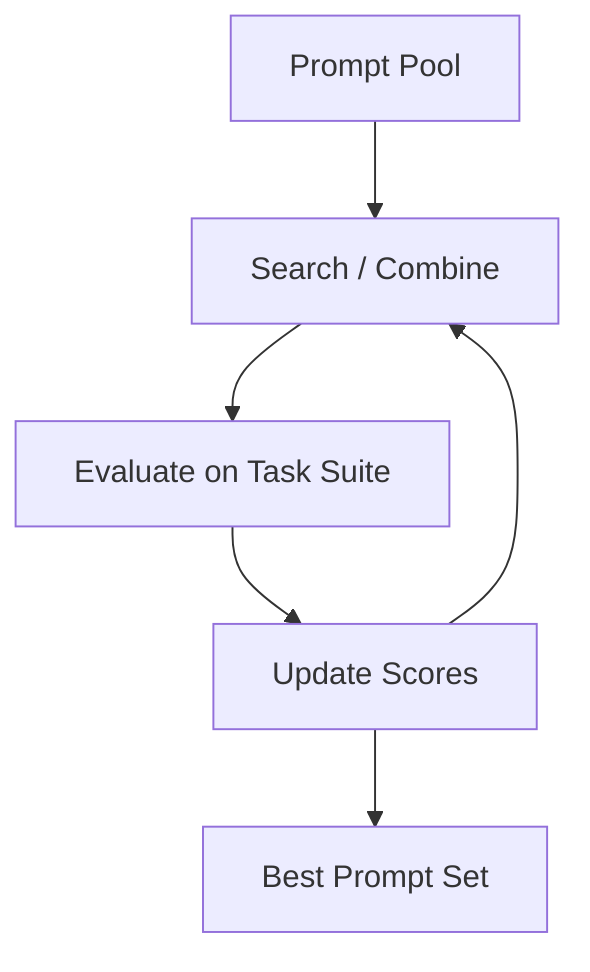
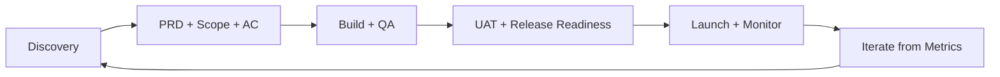

<!-- =========================================================
  FINAL GitHub Profile README (COMPREHENSIVE)
  Save this as: README.md
  For GitHub Profile README:
  1) Create a PUBLIC repo named exactly: shasan11
  2) Put this README.md in that repo
  3) Edit the placeholders: LinkedIn, email, portfolio, repo links

  NOTE: Tailwind components do NOT render on GitHub READMEs.
  What DOES render: badges, SVG cards, Mermaid diagrams, images/GIFs, HTML tables.
========================================================== -->

<h1 align="center">Hi, I’m Shasan Dhakal 👋</h1>

<p align="center">
  <b>Full-Stack Engineer • ML/Physics-Informed Modeling • Product/Project Execution</b><br/>
  I build end-to-end systems: research prototypes → production APIs → polished UIs — with delivery discipline.
</p>

<p align="center">
  <a href="https://github.com/shasan11"></a>
  <a href="https://linkedin.com/in/YOUR_LINKEDIN"></a>
  <a href="mailto:your.email@example.com"></a>
  <a href="https://your-portfolio.com"></a>
</p>

<p align="center">
  
  
  
</p>

<hr/>

## 🧠 About Me
I’m a builder who sits between **engineering** and **product execution**. I like problems where naive ML breaks in the real world — so I encode **constraints**, build **clean systems**, and ship **usable tools**.

- 🧬 **Physics-aware ML**: symmetries, conservation laws, PDE consistency  
- 🌊 **Fluid super-resolution**: real-time upscaling while preserving core physics  
- 🧠 **LLM prompt optimization**: search strategies that reduce manual prompt trial-and-error  
- 🎥 **Differentiable rendering**: backprop through light transport for inverse problems  
- 📈 **Risk-aware RL**: constrained decisions + benchmarking against classical baselines  
- ⚙️ **Full-stack systems**: APIs, auth, RBAC, CI/CD, cloud deployments  

> Brutal truth: GitHub doesn’t render Tailwind components in README.  
> To make this visually premium, we use SVG cards, Mermaid diagrams, images/GIFs, badges, and clean HTML layout.

---

## 🔥 What I Do (High Signal)

### Engineering
- Build **React/Next.js** frontends (Redux, component architecture, performance hygiene)
- Design **REST/GraphQL** backends (Django/DRF, Node/Express, Laravel)
- Implement **JWT auth**, RBAC/permissions, WebSockets, background jobs
- Data & performance: indexing, caching patterns, query tuning
- CI/CD: lint → test → build → deploy; infra basics via Docker/Terraform

### Product / Project Delivery
- Discovery: stakeholder mapping, workflow modeling, constraints, success metrics
- Execution: PRDs, user stories, acceptance criteria, edge cases, UAT readiness
- Prioritization: RICE / MoSCoW, scope boundaries, change control
- Delivery: sprint planning, dependency mgmt, release checklists, retro learning loops
- Outcomes: instrumentation mindset (events, dashboards, adoption/retention)

---

## 🧰 Tech Stack
<p align="center">
  
</p>

**Frontend:** HTML5, CSS3, JavaScript (ES6+), TypeScript, React, Next.js, Redux, Tailwind  
**Backend:** Node.js, Express.js, Django/DRF, Laravel, GraphQL  
**Databases:** PostgreSQL, MySQL, MongoDB, Firebase  
**DevOps/Cloud:** Docker, Kubernetes, AWS (EC2/S3/Lambda), GCP, GitHub Actions, CI/CD, Terraform  
**Tools:** Git, GitHub/GitLab, Jira, Postman  
**Other:** WebSockets, JWT, Agile/Scrum, Unit Testing (Jest/Mocha), WordPress, Product Management, LangChain  

---

## 🚀 Featured Projects (Research + Engineering)
> Replace repo links once published. Until then, this is still “profile-ready”.

<table>
  <tr>
    <td width="50%" valign="top">
      <h3>🧬 Physically-Constrained GNNs for Quantum Properties</h3>
      <p>Graph neural network encoding physical symmetries and conservation laws to improve molecular energy + force prediction.</p>
      <ul>
        <li>Symmetry-aware features + physics-based constraints</li>
        <li>Stability & generalization improvements vs unconstrained baselines</li>
        <li>Reproducible configs + evaluation harness</li>
      </ul>
      <p>
        
        
      </p>
      <a href="https://github.com/shasan11/phys-gnn-quantum-properties">Repo</a> •
      <a href="https://github.com/shasan11/phys-gnn-quantum-properties#results">Results</a> •
      <a href="https://github.com/shasan11/phys-gnn-quantum-properties#reproduce">Reproduce</a>
    </td>
    <td width="50%" valign="top">
      <h3>🌊 Physics-Consistent Fluid Super-Resolution</h3>
      <p>Neural upscaling model converting coarse simulations into high-res fields while preserving key Navier–Stokes structure.</p>
      <ul>
        <li>Physics-consistency losses (divergence / residual penalties)</li>
        <li>Real-time inference target for interactive use</li>
        <li>Visualization + validation metrics included</li>
      </ul>
      <p>
        
        
      </p>
      <a href="https://github.com/shasan11/physics-fluid-superres">Repo</a> •
      <a href="https://github.com/shasan11/physics-fluid-superres#demo">Demo</a> •
      <a href="https://github.com/shasan11/physics-fluid-superres#benchmarks">Benchmarks</a>
    </td>
  </tr>

  <tr>
    <td width="50%" valign="top">
      <h3>🧠 Quantum-Inspired Prompt Optimization for LLMs</h3>
      <p>Search strategy combining prompts in an interference-like way to boost accuracy with fewer manual prompt trials.</p>
      <ul>
        <li>Prompt pool → combination search → evaluation harness</li>
        <li>Pluggable with LangChain or raw API calls</li>
        <li>Regression-friendly task suite design</li>
      </ul>
      <p>
        
        
      </p>
      <a href="https://github.com/shasan11/quantum-prompt-optimizer">Repo</a> •
      <a href="https://github.com/shasan11/quantum-prompt-optimizer#eval">Eval</a> •
      <a href="https://github.com/shasan11/quantum-prompt-optimizer#usage">Usage</a>
    </td>
    <td width="50%" valign="top">
      <h3>🎥 Differentiable Ray Tracer for Inverse Rendering</h3>
      <p>Custom ray tracer where you can backpropagate through light transport to recover materials and lighting from images.</p>
      <ul>
        <li>Differentiable rendering pipeline</li>
        <li>Inverse rendering optimization loops</li>
        <li>Optional acceleration structures (BVH)</li>
      </ul>
      <p>
        
        
      </p>
      <a href="https://github.com/shasan11/differentiable-ray-tracer">Repo</a> •
      <a href="https://github.com/shasan11/differentiable-ray-tracer#rendering">Rendering</a> •
      <a href="https://github.com/shasan11/differentiable-ray-tracer#inverse">Inverse</a>
    </td>
  </tr>

  <tr>
    <td width="50%" valign="top">
      <h3>📈 RL-Based Risk-Aware Portfolio Optimizer</h3>
      <p>RL agent allocating assets under volatility constraints, benchmarked against classical quant methods.</p>
      <ul>
        <li>Risk-aware reward shaping + constraint handling</li>
        <li>Backtesting harness + baseline models</li>
        <li>Reporting & comparability scripts</li>
      </ul>
      <p>
        
        
      </p>
      <a href="https://github.com/shasan11/risk-aware-rl-portfolio">Repo</a> •
      <a href="https://github.com/shasan11/risk-aware-rl-portfolio#backtest">Backtests</a> •
      <a href="https://github.com/shasan11/risk-aware-rl-portfolio#baselines">Baselines</a>
    </td>
    <td width="50%" valign="top">
      <h3>🧭 Optimal Transport Embeddings</h3>
      <p>Representation learning experiments using optimal transport for alignment and distribution shift.</p>
      <ul>
        <li>OT-based objectives + embedding alignment</li>
        <li>Visualization & metrics</li>
        <li>Research sandbox with reproducible runs</li>
      </ul>
      <p>
        
        
      </p>
      <a href="https://github.com/shasan11/optimal-transport-embeddings">Repo</a> •
      <a href="https://github.com/shasan11/optimal-transport-embeddings#experiments">Experiments</a>
    </td>
  </tr>
</table>

---

## 🧩 How I Ship (Project Management Operating System)

### Step 1 — Discovery (Week 0)
- Identify stakeholders (users, buyers, ops, finance, support)
- Map workflows end-to-end (happy path + handoffs)
- Capture constraints (time, budget, tech debt, compliance)
- Define success criteria (measurable, not vibes)

### Step 2 — Scope Like an Adult (Week 1)
- Tight scope boundaries + explicit assumptions
- Tradeoffs documented (speed vs correctness vs cost)
- Phased delivery plan (MVP → Iteration → Scale)

### Step 3 — Ship With Quality (Weeks 2+)
- Acceptance criteria → QA alignment → test plan
- Release checklist: migrations, rollbacks, logs, monitoring, docs
- Change control: new requests go to backlog with impact analysis

### Step 4 — Design for Operators
- Reduce clicks, prevent errors, handle edge cases
- Guardrails: permissions, validations, safe defaults
- Clear UX for “what happens next”

### Step 5 — Launch + Learn
- Instrumentation: events + dashboards
- Post-launch review: outcomes, gaps, next sprint priorities

---

## 🧱 Diagrams (Mermaid)

### Fluid Super-Resolution Pipeline
```mermaid
flowchart LR
  A[Low-Res Simulation] --> B[Preprocess / Normalize]
  B --> C[Neural Upscaler]
  C --> D[High-Res Field]
  D --> E[Physics Losses<br/>(divergence / residual)]
  E --> C
  D --> F[Metrics + Visualization]
```

### Prompt Optimization Loop

```mermaid
flowchart TD
  P[Prompt Pool] --> S[Search / Combine]
  S --> E[Evaluate on Task Suite]
  E --> U[Update Scores]
  U --> S
  U --> Best[Best Prompt Set]
```

### Delivery Flow

```mermaid
flowchart LR
  D[Discovery] --> PRD[PRD + Scope + AC]
  PRD --> DEV[Build + QA]
  DEV --> UAT[UAT + Release Readiness]
  UAT --> LAUNCH[Launch + Monitor]
  LAUNCH --> ITER[Iterate from Metrics]
  ITER --> D
```

---

## 📊 GitHub Stats & Visuals
<p align="center">
  
  
</p>

<p align="center">
  
</p>

<p align="center">
  
</p>

<p align="center">
  
</p>

---

## ✅ Quality Bar (What you’ll find in my repos)
- Strong `README`: problem → approach → results → how to run → reproduce
- `configs/` for reproducible experiments
- `src/` for implementation
- `scripts/` for training/eval/export
- `tests/` for unit tests (where it matters)
- `docs/` for diagrams + writeups
- Optional `api/` and `web/` for deployable demos

---

## 🔒 Security / Reliability Mindset
- JWT auth: refresh flows, secure storage patterns, token rotation awareness
- RBAC: least privilege, audit-friendly permission structures
- CI/CD gates: lint + tests + build before deploy
- Data safety: migrations, backups, indexing, input validation
- Observability: logs, metrics, tracing basics for production

---

## 🤖 LLM / LangChain Approach
- Treat prompts like code: versioned, evaluated, regression-tested
- Prefer automation: search/optimization + evaluation harness
- Log inputs/outputs for debugging and performance tracking

---

## 📫 Contact
- Email: your.email@example.com
- LinkedIn: https://linkedin.com/in/YOUR_LINKEDIN
- Portfolio: https://your-portfolio.com

---

<details>
  <summary><b>⚙️ Optional: Add a Contribution Snake (looks premium)</b></summary>

GitHub doesn’t generate it automatically. You add it via Actions.

After setup, embed:
```md

```
</details>

<details>
  <summary><b>🖼️ Optional: Add real “graphics” that actually matter</b></summary>

The best-looking profiles use **GIFs/screenshots** from actual projects:

```md
<p align="center">
  
</p>
```

Create `/assets` folder and drop demos there.
</details>

<!-- ========================= END ========================= -->
